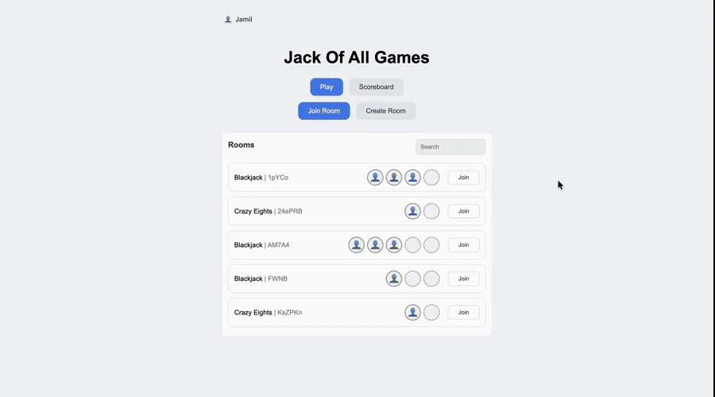
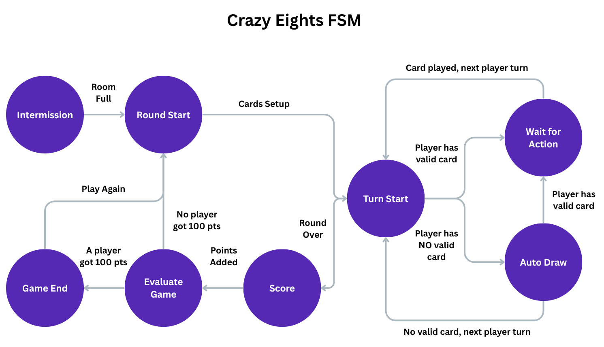

# Jack of All Games

A real-time multiplayer card game platform built with Flask and Socket.IO. Create a room, share the code, and play Blackjack or Crazy Eights live with friends!

<!--  -->

## Features

- **Real-time multiplayer** — rooms are created and joined with a short code; every action (draw, hit, stand, play a card) is broadcast to the table instantly over Socket.IO.
- **Two full games** — Blackjack (dealer AI, bust/blackjack detection, per-round scoring) and Crazy Eights (suit-matching, wild-eight suit selection, penalty draws).
- **Accounts and stats** — registration with hashed passwords, persistent win/loss tracking per user.
- **Built to add more games** — each game plugs into the same room/socket infrastructure through a shared interface, so a new game type is additive rather than a rewrite.

## Tech Stack

**Frontend:** JavaScript, Socket.IO client

**Backend:** Python, Flask, Flask-SocketIO, SQLite, Werkzeug (auth)

## Architecture

Each game's round-by-round flow is driven by a finite-state-machine. The fsm class deals with moving through states and updating them while the state class offers the template for creating new states and adding them to the fsm. This makes adding new games straightforward: implement the state interface, and the FSM handles the rest. Here is Crazy Eights' FSM as an example:



Each state consists of 3 phases `OnEnter` / `Update` / `OnExit`:

**OnEnter:** Usually consists of a state's setup code, like rendering "Player X Turn" on the screen before a player starts their turn or shuffling the deck before the round starts.

**Update:** Usually contains the state's main body, like the loop waiting for a player to play a card or drawing cards for the `Auto Draw` state.

**OnExit:** Usually consists of a state's cleanup code before moving on to the next state.

## Getting Started

```bash
git clone https://github.com/JamilHassiba/jack-of-all-games.git
cd jack-of-all-games

python3 -m venv .venv
source .venv/bin/activate      # Windows: .venv\Scripts\activate

pip install -r requirements.txt
python3 backend.py
```

The app runs at `http://localhost:5000`. Open it in two browser windows (or send the room code to a friend) to test multiplayer.

## Project Structure

```
backend.py              # Flask app, routes, Socket.IO event handlers
game.py                 # Game/player domain logic (Blackjack, Crazy Eights)
api.py                  # Client for the external deck-of-cards API
static/states/          # Finite-state-machine classes driving each game's round flow
static/games/           # Per-game frontend controllers
templates/              # Pages
```

## Team

Built as a first-year group project by Jamil Hassiba, Ryan Chan, Thomas McPhee, Cam Clarke, and Abhi Kalakoti.
